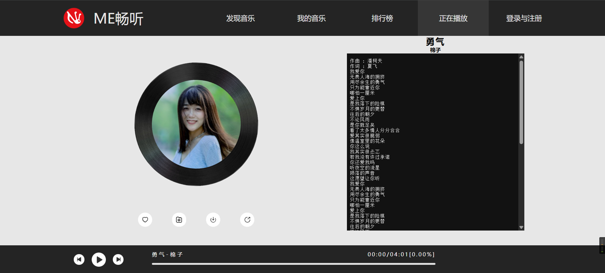

# ME畅听 - 感受音乐的魅力

## 项目简介



ME畅听是一个简洁优雅的在线音乐播放器，提供流畅的音乐播放体验和美观的用户界面。该项目使用纯前端技术实现，无需后端支持即可运行。

## 功能特点

- 🎵 在线音乐播放与控制（播放/暂停、上一首、下一首）
- ❤️ 歌曲喜欢与收藏功能
- 📥 音乐下载支持
- 📊 实时播放进度显示
- 🎨 响应式界面设计
- 📝 同步歌词显示
- 🔀 随机播放功能
- 👤 歌手头像展示

## 技术栈

- HTML5
- CSS3
- JavaScript (原生)
- HTML5 Audio API

## 项目结构

```
ME畅听/
├── audio/          # 音乐文件目录
├── css/            # 样式文件目录
│   └── MeMusic.css
│   └── Login_Register.css
├── img/            # 图片资源目录
├── js/             # JavaScript文件目录
│   └── MeMusic.js
│   └── Register.js
│   └── Login.js
├── lrc/            # 歌词文件目录
├── MeMusic.html    # 主页面
└── Login.html      # 登录页面
└── Register.html
```

## 使用说明

1. 直接打开 `MeMusic.html` 即可开始使用
2. 点击播放按钮开始播放音乐
3. 使用上一首/下一首按钮切换歌曲
4. 点击喜欢按钮收藏当前歌曲
5. 使用下载按钮保存当前播放的歌曲

## 自定义音乐

要添加自定义音乐，需要：
1. 将音乐文件放入 `audio/` 目录，命名格式为"歌曲名-歌手名.mp3"
2. 将歌手图片放入 `img/` 目录，命名为"歌手名.jpg"
3. 将歌词文件放入 `lrc/` 目录，按顺序命名为"0.txt", "1.txt"等
4. 在 `MeMusic.js` 中更新 `songIndex` 和 `singerIndex` 数组

## 浏览器兼容性

支持所有现代浏览器，包括：
- Chrome 60+
- Firefox 55+
- Safari 12+
- Edge 79+

## 许可证

本项目仅用于学习和演示目的。音乐资源版权归原作者所有，请勿用于商业用途。

## 贡献

欢迎提交 Issue 和 Pull Request 来改进这个项目。

## 作者

ME畅听由前端爱好者开发，致力于提供简洁优雅的音乐体验。

---

享受ME畅听带来的音乐之旅吧！🎶

